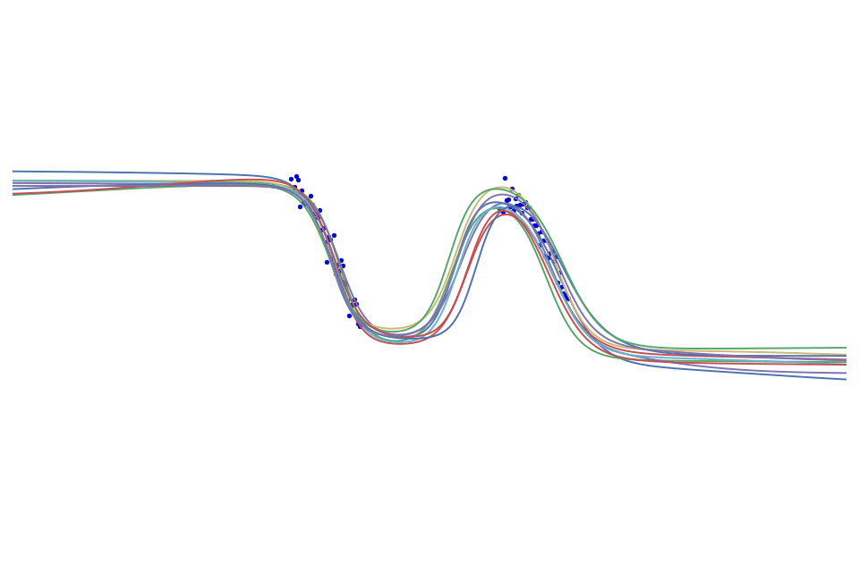

# bayesian-nn
bayesian-nn is a lightweight [*Bayesian neural network*]() library built on top of tensorflow to ease network training via 
[*variational inference* (VI)](https://en.wikipedia.org/wiki/Variational_Bayesian_methods). The library is intended to resemble [slim](https://github.com/tensorflow/tensorflow/tree/master/tensorflow/contrib/slim) and help avoid massive boilerplate code. The end goal is to facilitate speedy development of Bayesian neural net models in the case where multiple stacked layers are required.

**Note: This project is still under active development!**

## Installation
```bash
pip install bayesian-nn
```

## Usage
```python
import bayesian-nn as bnn
```

## How are Bayesian neural nets trained with VI?


Bayesian neural networks are just like ordinary neural networks except that weights are given an explicit prior distribution, and the inferred posterior distribution given the training data is used to make predictions on new data. In addition to help avoid overfitting, Bayesian neural nets also give predictive uncertainty.

When making predictions, the model takes in account all weight configurations according to its posterior distribution. In practice the expectation could be approximated through Monte Carlo.

In addition, the posterior distribution of the weights could be approximated through variational inference, where the evidence/variational lower bound (or negative variational free energy) is optimized so that the KL-divergence between the approximate and true posterior is minimized.

## Layers
bayesian-nn primarily provides the user with the flexibility of stacking neural net layers where weights follow an approximate posterior distribution.

Pre-implemented layers include:

Layer | bayesian-nn
------- | --------
FullyConnected | [bnn.fully_connected]()
Conv2d | [bnn.conv2d]()
Conv2dTranspose (Deconv) | [bnn.conv2d_transpose]()
RNN | [bnn.rnn]()

Toy example of a 2-layer (excluding input layer) Bayesian neural net for 1D regression:

```python
x = tf.placeholder(dtype=tf.float32, shape=[None, 1])
y = tf.placeholder(dtype=tf.float32, shape=[None, 1])

net, kl_1 = bnn.fully_connected(x,   10, activation_fn=tf.nn.relu)  # hidden layer with 10 units
net, kl_2 = bnn.fully_connected(net, 1,  activation_fn=None)

elbo = - tf.reduce_sum((y - net) ** 2)  - kl_1 - kl_2               # evidence lower bound

train_op = tf.train.AdamOptimizer(learning_rate).minimize(-elbo)
...
```

In the above example, kl_1 and kl_2 are the KL divergences between the approximate posterior distribution and prior distribution for the input-to-hidden and hidden-to-output weights respectively. By default, these weights follow a factorized unit Gaussian prior, and the approximate posterior is also a factorised Gaussian whose mean and variance parameters are learned. This special case of learning a Bayesian neural net through VI is also referred to as 
[Bayes by Backprop](https://arxiv.org/abs/1505.05424).

Additionally, the user has the flexibility to use arbitrary prior and approximate posterior distributions, so long as it's possible to evaluate the density of the prior as well as the approximate posterior at samples from the latter. To achieve this, the optional parameters `posterior_sampler`, `log_posterior`, and `log_prior` should be specified.

```python
mean = tf.get_variable(...)
standard_deviation = tf.get_variable(...)

zeros = tf.zeros_like(mean)
ones = tf.ones_like(standard_deviation)

# reparameterization trick
sampler = lambda : mean + standard_deviation * tf.random_normal([num_inputs, num_outputs])

log_normal = lambda mu, sigma, sample: ...  # evaluate log density of normal at some sample
log_q = lambda sample: log_normal(mean, standard_deviation, sample)
log_p = lambda sample: log_normal(zeros, ones, sample)

net, kl = bnn.fully_connected(net, num_outputs, 
                              posterior_sampler=sampler, 
                              log_posterior=log_q, log_prior=log_p, 
                              activation_fn=tf.nn.relu)
```

## Supported Features from Slim
bayesian-nn is also compatible with features from 
[slim](https://github.com/tensorflow/tensorflow/tree/master/tensorflow/contrib/slim)
Thus, it is possible to further simplify boilerplate code with the additional support of such features:

* [arg_scope](): allow users to define default arguments for specific operations within that scope.
* [repeat](): allow users to repeatedly perform the same operation with the same parameters.
* [stack](): allow users to perform the same operation with different parameters.

## References
